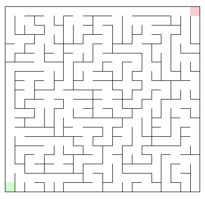

# dojo-maze

Maze generation in Dojo and TypeScript. Implementations based on the book ["Mazes for Programmers"](https://pragprog.com/book/jbmaze/mazes-for-programmers) by Jamis Buck.

## Maze Algorithms

Sidewinder

